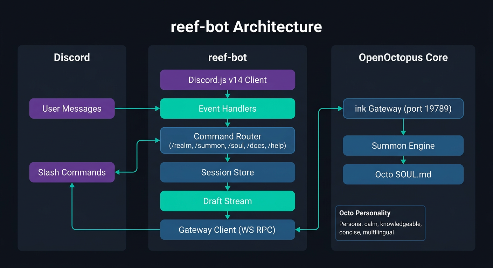

<p align="center">
  <picture>
    <source media="(prefers-color-scheme: light)" srcset="https://raw.githubusercontent.com/open-octopus/openoctopus.club/main/src/assets/brand/logo-dark.png">
    
  </picture>
</p>

<h3 align="center">reef-bot</h3>

<p align="center">
  Discord community bot powered by a summoned Octo agent — the mascot of The Reef comes alive.
</p>

<p align="center">
  <a href="https://github.com/open-octopus/reef-bot/actions/workflows/ci.yml"></a>
  <a href="https://github.com/open-octopus/reef-bot/blob/main/LICENSE"></a>
  <a href="#"></a>
  <a href="https://github.com/open-octopus/openoctopus"></a>
  <a href="https://discord.gg/openoctopus"></a>
</p>

---

> **Status: Alpha** — Discord bot with slash commands, webhook handlers, streaming chat, scheduled posts, and gateway integration with 97 tests passing.

## What is reef-bot?

**reef-bot** is the official Discord bot for [The Reef](https://discord.gg/openoctopus), the OpenOctopus community server. Unlike a typical moderation bot, reef-bot is a **summoned Octo agent** — the project mascot brought to life through the Summon engine.

Octo lives in The Reef, answers questions about OpenOctopus, helps newcomers get started, showcases realm packages, and occasionally drops octopus-themed wisdom.

## Planned Features

- **Conversational AI** — Chat with Octo using natural language, powered by the Summon engine
- **Realm lookup** — `/realm info pet` to get details about any realm package
- **SOUL.md preview** — Paste a SOUL.md and see a formatted personality card
- **New member onboarding** — Welcome messages with role assignment guidance
- **Showcase highlights** — Pin and promote community showcase posts
- **GitHub integration** — Post release notes and notable PRs to `#announcements`
- **Summon demo** — `/summon demo` to see a live Summon interaction

## Planned Architecture

<p align="center">
  
</p>

## Planned Tech Stack

| Component | Choice |
|-----------|--------|
| Runtime | Node.js >= 22 + TypeScript |
| Discord Library | Discord.js v14 |
| Connection to Core | WebSocket RPC (port 19789) |
| Personality | SOUL.md (Octo mascot personality) |

## Octo's Personality

reef-bot runs on a SOUL.md file that defines the Octo mascot personality:

- **Calm and knowledgeable** — like a wise deep-sea creature
- **Helpful but concise** — answers directly, no fluff
- **Occasional humor** — octopus puns and tentacle metaphors, used sparingly
- **Multilingual** — responds in English and Chinese

> *"A deep-sea octopus, definitely."* — Octo

### Octo's SOUL.md

```yaml
---
name: Octo
entityId: entity_octo_mascot
realm: community
identity:
  role: community mascot and guide
  personality: >-
    Calm, knowledgeable, and approachable. Wise like a deep-sea
    creature that has seen many things. Concise but warm.
  background: >-
    Born from the depths of The Reef when OpenOctopus was created.
    Knows every corner of the ecosystem.
  speaking_style: >-
    Direct and helpful. Occasional octopus metaphors and dry humor.
    Never uses emojis excessively. Responds in the user's language.
catchphrases:
  - "Let me reach into that realm for you."
  - "Eight arms, always ready to help."
coreMemory:
  - The Reef community launched with OpenOctopus
  - Every Realm deserves its own tentacle
proactiveRules:
  - trigger: event
    action: Welcome new members with a brief intro to OpenOctopus
  - trigger: schedule
    action: Post weekly Realm of the Week showcase
    interval: weekly
---
```

## Planned Slash Commands

| Command | Description |
|---------|-------------|
| `/realm info <name>` | Show details about a realm package |
| `/realm list` | List available realms |
| `/summon demo` | Live demo of a Summon interaction |
| `/soul preview` | Paste a SOUL.md and see a formatted card |
| `/docs <topic>` | Quick link to relevant documentation |
| `/help` | How to get started with OpenOctopus |

## Planned Quick Start

```bash
# Clone
git clone https://github.com/open-octopus/reef-bot.git
cd reef-bot

# Install
pnpm install

# Configure
cp .env.example .env
# Edit .env with your Discord bot token and ink gateway URL

# Run in development
pnpm dev

# Run tests
pnpm test
```

### Environment Variables

| Variable | Description |
|----------|-------------|
| `DISCORD_BOT_TOKEN` | Discord bot token (from Discord Developer Portal) |
| `INK_GATEWAY_URL` | ink gateway WebSocket URL (`ws://localhost:19789`) |
| `DISCORD_GUILD_ID` | The Reef server ID (for slash command registration) |

## Roadmap

- [ ] Discord.js bot scaffold with slash commands
- [ ] WebSocket RPC connection to ink gateway
- [ ] Octo SOUL.md personality file
- [ ] Conversational responses via Summon engine
- [ ] `/realm` and `/summon` slash commands
- [ ] GitHub webhook integration
- [ ] New member welcome flow

## Related Projects

| Project | Description |
|---------|-------------|
| [openoctopus](https://github.com/open-octopus/openoctopus) | Core monorepo — Summon engine and ink gateway |
| [community](https://github.com/open-octopus/community) | The Reef community policies and docs |
| [soul-gallery](https://github.com/open-octopus/soul-gallery) | SOUL.md template gallery |

## Contributing

reef-bot is in the planning phase. Join [The Reef (Discord)](https://discord.gg/openoctopus) to discuss the design, or open an issue with feature ideas.

See [CONTRIBUTING.md](https://github.com/open-octopus/.github/blob/main/CONTRIBUTING.md) for general guidelines.

## License

[MIT](LICENSE) — see the [.github repo](https://github.com/open-octopus/.github) for the full license text.
